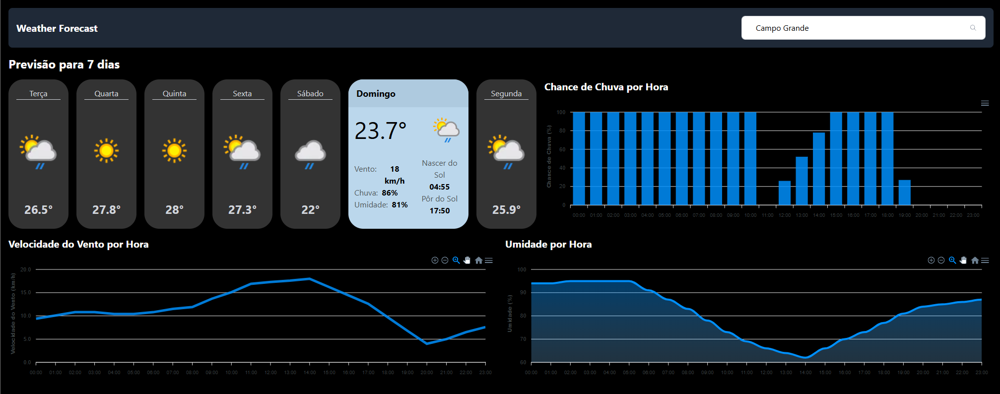

# Weather Workshop

```
git clone git@github.com:tecsinapse/weather-workshop.git
```

## UI final do projeto



**Obs**: Na UI final do projeto estamos mostrando 7 dias, porém, a chave de API utilizada possui um período grátis, após esse período, conseguimos buscar apenas 3 dias.
Portanto, no app final, teremos a previsão para 3 dias com apenas 3 cards.

Referências:

- https://git-scm.com/downloads/win
- https://vite.dev/
- https://tailwindcss.com/
- https://daisyui.com/
- https://www.weatherapi.com/
- https://pnpm.io/installation
